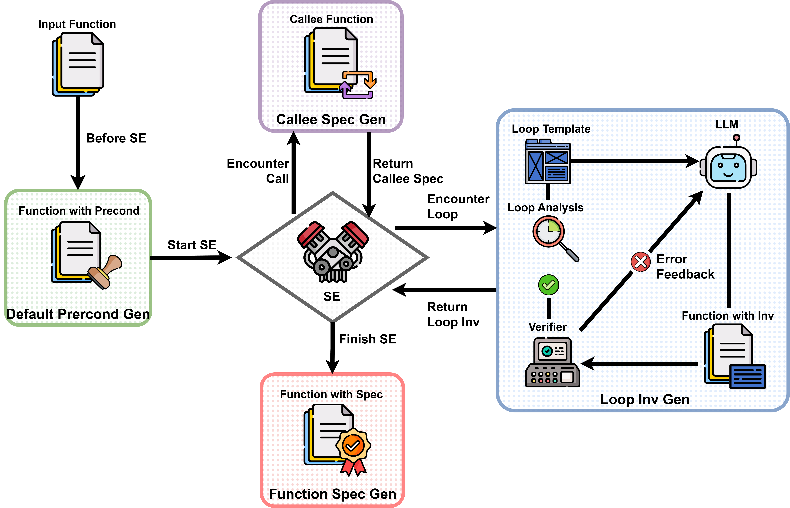
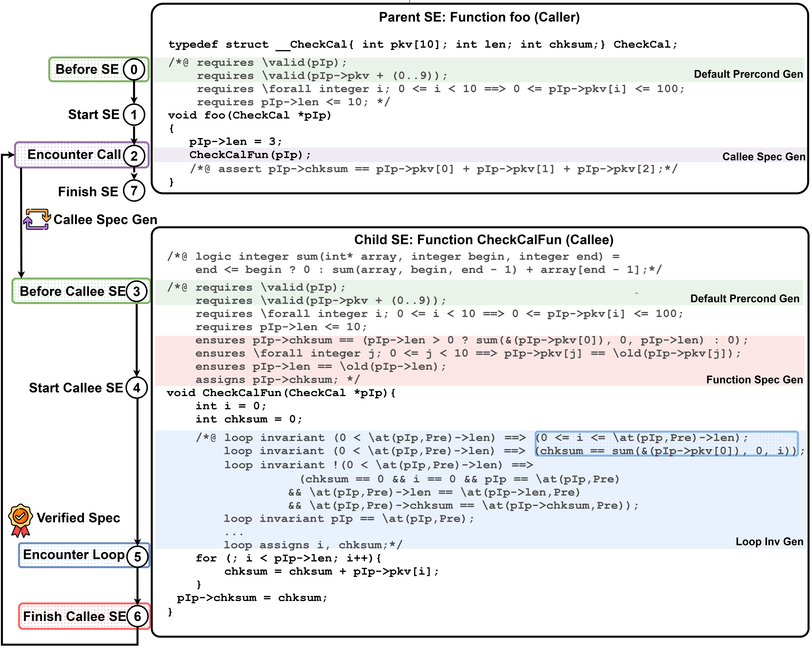

# SESpec

SESpec is a toolkit designed for end-to-end generation of ACSL specifications for C programs. 

### Overview of SESpec



### Repository Structure
- `src/`: Main source for specification generation workflows
  - `input/`: input dictionary, input programs with manually annotated ACSL format preconditions and verification goals
  - `output/`: output dictionary, output programs with complete ACSL format specifications
- `configs/`: Configuration files for the specification generation process
  - `func_config.json`: Default configuration file for function specification generation
  - `loop_config.yaml`: Configuration file for loop invariant generation

- `RESULTS/`: Raw experiment results
- `VST/`: Symbolic executor

### Requirements
- Linux (Ubuntu 22.04)
- Python 3.9+ (3.10/3.11 recommended)
- Frama-C (29.0 Copper)
- LLVM-config-18 (18.1.8)

### Setup 
##### Python Environment

```bash
conda env create -f environment.yml
conda activate ASGSE
```

##### Openai-API Config

add your own api key and base url in `config.py`

```python
api_key:str = "your-key" 
base_url:str = "your-base-url" 
```

##### Verify

```bash
#run
llvm-config-18 --version
#see
18.1.8
```
```bash
#run
clang-18 --version
#see
Ubuntu clang version 18.1.8 (++20240731024944+3b5b5c1ec4a3-1~exp1~20240731145000.144)
Target: x86_64-pc-linux-gnu
Thread model: posix
InstalledDir: /usr/bin
```

```bash
#run
frama-c -v
#see
29.0 (Copper)
```

##### init opam

```bash
#run
cd src
bash init.sh
#see
opam environment loaded successfully
```

### Quick Start

```bash
#run
cd src
```

```bash
#run
python main.py
```
for motivating example *CheckCalFun*



### Instructions

ASGSE now supports configuration via a dedicated file, offering a more flexible and maintainable way to manage settings. 

Two configuration file formats are supported:

- JSON format (.json)
- YAML format (.yml, .yaml)


#### Configuration File Structure

##### 1. Main process configuration

This section contains settings for the program specifications generation process.

```yaml
main:
  root_dir: "motivation_example"      # Project root directory
  function_name: "foo"                # Name of the function to generate
  debug: true                         # Enable debug mode
  only_loop: false                    # Only generate loop invariant
  auto_annotation: true               # Automated generate precondition
  refine_count: 3                     # Number of refinement passes
  pass_count: 5                       # Number of passes
  think: true                         # Enable "think in natural language" mode
  template: true                      # Enable loop invariant template
  auto_post: true                     # Automated generate postconditions
  use_db: false                       # Enable database
```

##### 2. LLM Configuration 

This section holds settings for the Large Language Model (LLM) integration.

```yml
llm:
  api_model: "gpt-4o"                 # API model name
```

##### 3. Precondition Configuration

This section allows you to define custom preconditions in VST user assertion for specific functions. You should add same preconditions in ACSL format directly in input file.

```yml
preconditions:
  func: "emp" # emp for no preconditon (empty heap)
  # ... additional preconditions
```

#### Usage

##### 1.Basic Usage

Use the default configuration file (e.g., `configs/func_config.json`):

```bash
python main.py
```

Specify a custom configuration file:

```bash
python main.py --config configs/func_config.json
```

Use a yaml configuration file:

```bash
python main.py --config configs/loop_config.yaml
```

##### 2. Command-Line Argument Overrides

You can override any setting from the configuration file using command-line arguments.

Override the function name:

```bash
python main.py --function bar
```

for motivating example *TripleAbsMaxFun*

Override the project directory and function name: 

```bash
python main.py --config configs/loop_config.yaml --root-dir syGus_code2inv --function foo1
```

for the first loop in *SyGus*

##### 3. Help Information

Display the help message for a list of available options:

```bash
python main.py --help
```

